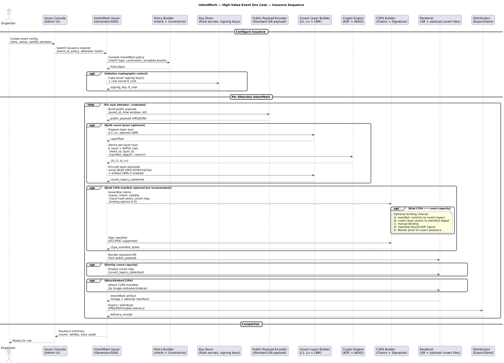

# IntentMark — High‑Value Event Access Use Case

## 1. Purpose

This document describes a **high‑value event access control use case** for IntentMark. It demonstrates how IntentMark can be applied to events where access misuse, impersonation, or leakage has **real financial, reputational, or safety impact**.

This use case is **illustrative**, not prescriptive. It shows one concrete way to apply IntentMark without constraining the core framework.

---

## 2. Problem Statement

High‑value events (invite‑only conferences, premium experiences, executive offsites, private launches, curated summits) face persistent access challenges:

* Screenshot or forwarded tickets
* Tier leakage (VIP / speaker / staff misuse)
* Offline or degraded connectivity at venues
* Temporary or minimally trained gate staff
* Social pressure to override controls
* Reputational risk from visible access failures

Existing QR‑based systems are typically **binary** (valid / invalid) and do not model real‑world access nuance.

---

## 3. Why IntentMark Is Appropriate

IntentMark is designed for environments where:

* A single visual artifact must serve multiple audiences
* Different verifiers require different disclosure depth
* Enforcement must be **quiet and contextual**, not confrontational
* Offline verification is essential

High‑value events meet all of these criteria.

---

## 4. Actors

* **Issuer**: Event organizer or authorized ticketing authority
* **Holder**: Attendee displaying the QR (phone or badge)
* **Verifier**: Gate staff, security personnel, or supervisor devices
* **Supervisor (optional)**: Central control or senior staff

---

## 5. IntentMark Artifact Structure

Each attendee is issued **one IntentMark**.

### 5.1 Public Payload (Always Readable)

* Event identifier
* Date / session window
* Non‑sensitive attendee reference (optional)

Purpose:

* Human context
* Backward compatibility
* Graceful fallback

---

### 5.2 Optional Covert Capacity (Progressive Disclosure)

Covert layers MAY be present depending on event policy:

* **L1 — Authenticity Marker**

  * Freshness / anti‑reuse signal
  * Screenshot or replay indicators

* **L2 — Access Tier**

  * General / VIP / Speaker / Staff
  * Zone or gate eligibility

* **L3 — Operational Controls (Optional)**

  * Internal routing hints
  * Audit or escalation flags

Each layer is independently encrypted and capability‑gated.

---

### 5.3 C2PA Manifest (Optional but Recommended)

The manifest MAY declare:

* Issuer identity
* Event intent ("access credential")
* Validity window
* Accepted verifier capabilities
* Binding to covert layers (if enabled)

---

## 6. Verification Flow (At the Gate)

1. Verifier scans the IntentMark
2. Public payload is decoded
3. Manifest is verified (if present)
4. Visual integrity is checked (if enabled)
5. Verifier attempts covert decoding progressively
6. Trust resolution is computed
7. Gate action is displayed

The verifier **stops decoding** at the highest layer it can validate.

---

## 7. Trust Resolution Outcomes

IntentMark supports **graded outcomes**, not just pass/fail:

* **Allow** — Access permitted
* **Allow with Warning** — Tier mismatch or screenshot suspicion
* **Escalate** — Supervisor review recommended
* **Deny** — Invalid or expired credential

This aligns with real‑world gate dynamics.

---

## 8. Offline Operation

* All verification can occur offline
* Issuer trust roots and manifests are cached
* No live backend dependency is required at the gate

This is critical for high‑density venues.

---

## 9. Security and Misuse Resistance

This use case addresses:

* Screenshot reuse
* Tier escalation attempts
* QR swapping or replacement
* Accidental over‑disclosure

It does **not** claim absolute fraud prevention. IntentMark focuses on **misuse resistance and intent clarity**, not adversarial elimination.

---

## 10. Benefits to Event Organizers

* One QR per attendee
* Reduced staff confrontation
* Fewer manual overrides
* Cleaner VIP handling
* Better post‑event confidence

---

## 11. Benefits to Attendees

* No visible status markers
* Faster entry
* Fewer awkward interactions

---

## 12. Why This Scales

This use case:

* Requires minimal user education
* Builds on existing QR behavior
* Allows incremental adoption
* Does not require specialized hardware

It is suitable as a **first production deployment** of IntentMark.

---

## 13. Explicit Non‑Goals

This use case does not require:

* Online identity verification
* Biometric checks
* Payment processing
* Perfect secrecy

IntentMark augments human workflows; it does not replace them.

---

## 14. Summary

High‑value events represent a natural, high‑impact environment for IntentMark deployment. They combine real stakes, complex access tiers, and offline constraints in a way that matches IntentMark’s design philosophy.

This use case demonstrates how IntentMark enables **progressive trust, quiet enforcement, and operational clarity** without changing how QR codes look or feel.