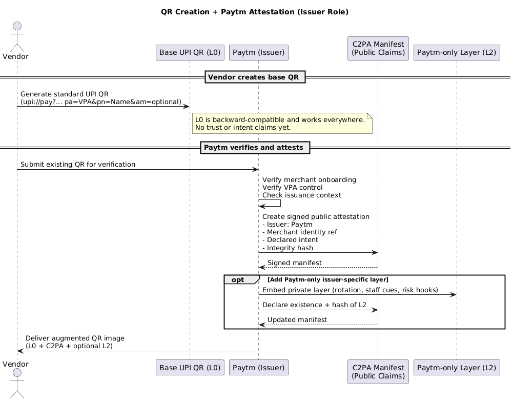
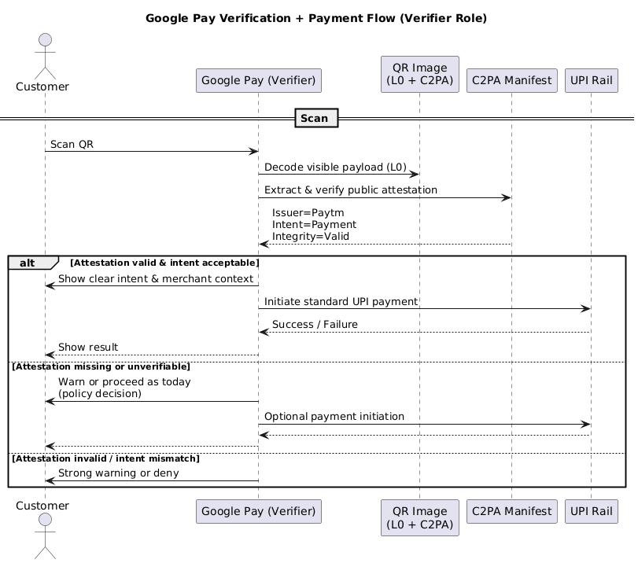
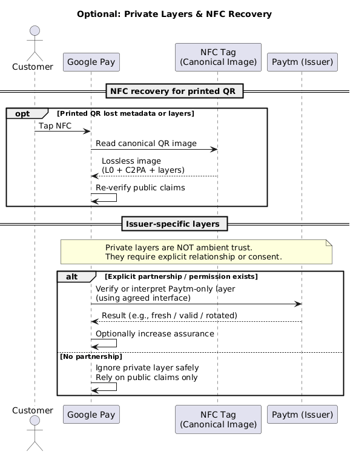

# IntentMark + UPI / Scan‑and‑Pay Payments — Explainer

## 1. Purpose

This document explains how **IntentMark complements UPI and other QR‑based scan‑and‑pay systems** (e.g., Pix, PayNow, SEPA QR, wallet QRs) by adding a **pre‑transaction intent and trust layer**.

IntentMark:

* does **not** replace payment rails
* does **not** process or route funds
* does **not** require changes to QR standards or networks

Instead, it helps users, apps, and future AI assistants understand **what a QR is intended to do before a payment is authorized**.

---

## 2. Why This Matters for UPI and Similar Systems

QR‑based payments are now the default interface for everyday transactions. As usage has scaled, so has ambiguity and misuse.

Key realities:

* Payment rails correctly verify **where money goes**, not **where the QR came from**
* QR codes are visually easy to replace, copy, or impersonate
* Users are trained to scan quickly, often under time pressure or social engineering

Regulators and networks have responded by:

* issuing consumer advisories on QR‑based scams
* restricting or removing historically abused "collect / pull" patterns

These measures reduce harm after abuse is observed, but they do not solve the root problem:

> **QR codes today are not self‑describing or verifiable at scan time.**

---

## 3. What IntentMark Adds (Without Touching the Rail)

IntentMark operates **before** the payment rail is invoked.

It adds explicit, verifiable answers to four questions:

1. **What is this QR meant to do?**

   * payer‑initiated merchant payment
   * donation
   * refund‑related flow

2. **Who is asserting that intent?**

   * merchant
   * institution
   * platform or issuer

3. **What constraints apply?**

   * amount bounds
   * freshness / expiry
   * contextual hints

4. **How should the verifier behave?**

   * allow
   * warn
   * deny

None of this changes how UPI or other rails execute payments.

---

## 4. UPI as a Concrete Example (What Works, What Doesn’t, and What Can Be Added)

UPI is a useful **representative example** because it is widely deployed, well-understood, and intentionally minimal. The same observations apply to other scan-and-pay systems such as Pix, PayNow, SEPA QR, and wallet-based QRs.

### 4.1 What a UPI QR Does Well

A standard UPI QR code typically contains:

* a **VPA (Virtual Payment Address)** identifying the recipient’s bank account
* an optional **payee name** (display metadata)
* optional transaction details (amount, note)

UPI guarantees that:

* the VPA is linked to a real bank account through KYC
* the transaction is encrypted and PIN-authorized
* funds are routed correctly and settled reliably

In short, UPI securely answers:

> **“Can money be sent to this account?”**

### 4.2 Structural Gaps in the Current UPI QR Model (By Design)

Despite strong rail security, several gaps exist at the **QR artifact and intent layer**:

**Alias vs Identity Gap**
VPAs are easy to create and customize - there are free online tools that can be used to do it - , and the payee name shown is self-declared metadata. There is no cryptographic binding between the QR image, the physical merchant context, and the real-world identity the user believes they are paying.

**Artifact Provenance Gap**
UPI validates the payment destination, not the origin or integrity of the QR image itself. Printed QRs can be copied, overlaid, or swapped without detection at scan time.

**Intent Ambiguity Gap**
UPI QRs do not explicitly declare whether they represent a payer-initiated payment, a collect/request flow, or a refund-related action. Payment apps infer intent after scanning, which is fragile under pressure or social engineering.

These gaps are not flaws in UPI; they are consequences of UPI’s intentionally simple and interoperable design.

### 4.3 IntentMark Solution Options for UPI (Non-Disruptive)

IntentMark does not replace UPI or require changes to UPI standards. It adds **optional, upstream trust signals** over the existing QR artifact.

**Option A — Wallet-Issued Public Attestation**
A wallet or PSP (e.g., Paytm, PhonePe, Google Pay) verifies an existing UPI QR and issues a public attestation stating:

* which VPA the QR routes to
* which merchant/entity the wallet has onboarded
* the declared intent (e.g., payer-initiated payment)

Any verifier can validate this attestation and decide how to act.

**Option B — Cross-Wallet Verification (Issuer ≠ Verifier)**
One wallet may issue an attestation (e.g., Paytm), while another wallet (e.g., Google Pay) verifies it. Public claims are interoperable; verification behavior remains local and policy-driven.

**Option C — Layered Augmentation (Capability-Gated)**
Issuers may add deeper layers (merchant-side cues, rotation markers, audit hooks) for use by their own apps or explicitly trusted partners. Other verifiers may ignore these layers safely.

**Option D — Print + NFC High-Assurance Artifacts**
For printed QRs, the canonical digital image (including attestations) may be stored in an NFC tag embedded in a card or stand. NFC enables recovery of lost fidelity without storing secrets or affecting payment rails.

### 4.4 What This Achieves for UPI

With IntentMark:

* UPI continues to securely move money
* QR artifacts become self-describing and verifiable
* intent is evaluated **before** authorization
* wallets can interoperate without sharing internal logic
* users receive clearer, earlier trust signals

UPI remains unchanged; the QR layer becomes safer and more expressive.

---

## 5. Threat Patterns Addressed

IntentMark is designed to reduce **misuse and ambiguity**, not to claim perfect fraud elimination.

### 4.1 QR Swap / Overlay (Sticker Swap)

A legitimate merchant QR is replaced with another QR pointing to a different payment address.

### 4.2 Social‑Engineering QRs

Victims are induced to scan a QR under false pretenses ("scan to receive refund", "verify KYC").

### 4.3 Action Ambiguity

Users cannot reliably tell whether a QR represents:

* a payer‑initiated payment
* a request / collect action
* a redirect or deep link

### 4.4 High‑Volume Merchant Disputes

In busy environments, unclear confirmation cues lead to disputes and reconciliation issues.

---

## 5. Core Design Principle: Intent Before Action

UPI and similar systems answer:

> **Can money be sent to this address?**

IntentMark answers:

> **Should this action happen at all?**

This separation keeps responsibilities clean and avoids protocol changes.

---

## 6. Artifact Model (Image‑Centric)

### 6.1 The QR Image as Source of Truth

The payment QR is treated as an **image artifact** that may include:

* visible QR
* optional layered / covert data
* optional C2PA metadata

That image is the **canonical truth**.

### 6.2 Print vs Digital Reality

* When shared digitally, full fidelity is preserved
* When printed, layers or metadata may degrade (expected)

### 6.3 Optional NFC Recovery (Print Scenarios Only)

For printed QRs, an optional **NFC adjunct** may store the canonical digital image, allowing:

* recovery of lost layers or metadata
* stronger verification in high‑risk contexts

No secrets, wallets, or logic are stored on the tag.

---

## 7. Verification Flow (High Level)

1. Decode public payment payload (backward compatible)
2. If present, verify IntentMark claims:

   * issuer authenticity
   * declared intent
   * constraints
3. Resolve outcome:

   * **Allow** (proceed to payment rail)
   * **Warn** (show risk or ambiguity)
   * **Deny** (block action)

If no IntentMark data is present, behavior is unchanged from today.

---

## 8. Layered Data & Role-Aware Interpretation (Who Is Scanning?)

IntentMark supports **layered data** and **role-aware verification**, allowing the *same QR image* to present different levels of meaning depending on **who is scanning and why** — without changing the visible QR.

This is especially important in payment contexts where customers, merchants, auditors, and automated systems all interact with the same artifact.

---

## 8.1 Scanner Roles (Illustrative)

Typical roles interacting with a payment QR include:

* **Customer / Payer**
* **Merchant Staff**
* **Merchant Platform / Aggregator**
* **Auditor / Compliance Officer**
* **AI Agent (wallet assistant, risk engine)**

IntentMark does not require these roles to be pre-registered globally. Instead, **capabilities emerge from what a verifier can decode and verify**.

---

## 8.2 Layered Data: Conceptual Levels

Layered data allows progressively richer signals to be embedded in the QR image, while keeping the visible QR unchanged.

### L0 — Visible QR (Universal)

* Standard payment payload
* Backward compatible
* Always readable

### L1 — Public Integrity Signals

* Authenticity markers
* Anti-tamper / anti-reuse hints
* Basic issuer assertions

Useful for:

* customers
* casual scans

### L2 — Restricted Verification Signals

* Merchant-side validation cues
* Rotation or freshness indicators
* Aggregator-issued claims

Useful for:

* merchant staff
* support workflows

### L3+ — High-Assurance / Enterprise Signals

* Audit identifiers
* Compliance hooks
* Policy references

Useful for:

* auditors
* regulated environments
* automated checks

Not all deployments need all layers.

---

## 8.3 Role-Based Value (Examples)

### Customer / Payer

* Clear declaration: *"This is a payer-initiated payment"*
* Warning on ambiguity or mismatch
* No exposure to internal or sensitive data

### Merchant Staff

* Ability to verify that the displayed QR is authentic
* Detection of swapped or outdated QRs
* Minimal training required

### Auditor / Compliance

* Stable identifiers for reconciliation
* Proof that intent claims were issued by authorized entities
* Offline-verifiable audit trails

### AI Agents

* Machine-readable intent semantics
* Policy-enforceable constraints (e.g., refuse risky flows)
* Reduced reliance on heuristics

---

## 8.4 Public vs Issuer-Specific Layers (Interoperability Model)

IntentMark deliberately distinguishes between **interoperable public layers** and **issuer- or app-specific layers**.

### Public Layers (Interoperable)

Public layers contain claims that *any verifier* can read and validate:

* issuer identity
* declared intent (e.g., payer-initiated payment)
* high-level assurance statements (e.g., "merchant verified by issuer")
* integrity bindings to the QR image

These layers are expected to be:

* cryptographically signed
* stable across apps
* usable for cross-wallet verification (e.g., Paytm-issued claims verified by Google Pay)

### Issuer-Specific Layers (Capability-Gated)

Issuer- or app-specific layers may contain:

* internal merchant tooling markers
* staff-only verification cues
* rotation counters or freshness signals
* proprietary risk or compliance hooks

These layers are:

* integrity-bound to the QR image
* optionally declared in the public attestation (existence + hash)
* meaningful only to the issuing app or explicitly trusted partners

Other verifiers may safely ignore these layers without losing the core trust signal.

### Why Additional Interaction Is Required

Deeper layers are **not ambient trust**. For another app to interpret them, there must be:

* an explicit bilateral agreement
* a shared profile or trust group
* or a deliberate handoff / permission flow

This mirrors established patterns in identity, API access, and federated trust systems.

### Design Principle

> **Public claims are interoperable. Private layers are relationship-bound. Verification behavior is always local.**

This separation enables innovation by issuers while preserving ecosystem-wide compatibility.**

This keeps the system:

* decentralized
* privacy-preserving
* backward compatible

---

## 9. C2PA Metadata as the Trust Backbone

C2PA metadata provides a standardized, cryptographically verifiable way to bind **issuer identity, intent claims, and visual integrity** to the QR image.

---

## 9.1 What C2PA Contributes

C2PA can encode:

* who issued the QR
* what intent is being asserted
* when it was issued
* what policies apply
* hashes of the visual content

This allows verifiers to:

* detect tampering or substitution
* distinguish authentic vs copied images
* apply policy consistently

---

## 9.2 Relationship Between C2PA and Layers

* C2PA provides the **authoritative manifest**
* Layered data can be:

  * referenced from C2PA claims
  * integrity-bound to the same image

This keeps layering:

* verifiable
* non-ambiguous
* auditable

---

## 9.3 Print, Screenshot, and NFC Recovery

* Digital sharing preserves full C2PA metadata
* Printing may strip metadata (expected)
* Optional NFC recovery can restore the canonical image for full verification

---

## 10. Deployment Models

### Model A — Payment App Integration

Best UX: intent cues appear directly in the payment flow.

### Model B — Companion Trust Scanner

A lightweight pre‑scan verifier hands off to the payment app.

### Model C — Merchant Verification Tool

Staff verify that displayed QRs are authentic and not swapped.

---

## 9. What This Does *Not* Do

IntentMark:

* does not custody funds
* does not modify payment addresses
* does not require online verification
* does not mandate NFC or special hardware

---

## 10. Why This Extends UPI (Instead of Competing)

UPI and similar systems are optimized for:

* routing
* settlement
* interoperability

IntentMark extends them by:

* making QRs self‑describing
* making intent explicit before authorization
* reducing ambiguity‑driven errors and scams
* preparing payment flows for AI‑assisted decision making

---

## 11. One-Sentence Framing

> **IntentMark lets the same payment QR safely mean different things to customers, merchants, auditors, and AI—without changing how payments work.**

---

## 12. Summary

QR‑based payments are ubiquitous and irreversible by design. Existing rails correctly execute transactions but deliberately avoid interpreting intent.

IntentMark fills that gap by adding a **verifiable intent layer upstream of the payment rail**, improving user understanding and trust without changing how payments work.
